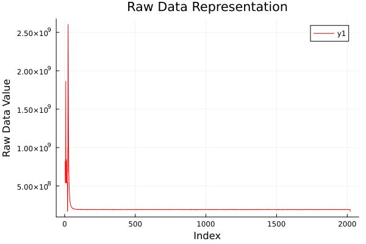
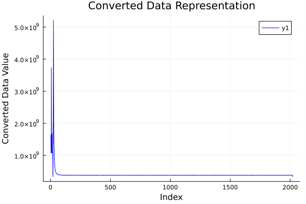

# julia-licel-data-processor
A Julia-based tool for reading, converting, and visualizing LiDAR data in LICEL format (https://licel.com/raw_data_format.html). Generates raw and converted datasets along with graphical plots for atmospheric research.

This repository contains a Julia script for processing atmospheric LiDAR data stored in **LICEL Data Format**.  
The script reads raw `.dat` files, extracts header and raw data, converts them, and generates plots for analysis.

---

## ✨ Features
- Reads input LICEL `.dat` files.
- Extracts and saves raw data in hexadecimal format.
- Converts raw data with customizable conversion logic.
- Generates and saves plots for both raw and converted data.

---

## 📂 File Paths
Modify the following paths in the script before running:

```julia
input_path = "path/to/input/file.dat"
output_raw_path = "path/to/output/raw_data.txt"
output_converted_path = "path/to/output/converted_data.txt"
plot_raw_path = "path/to/output/raw_data_plot.png"
plot_converted_path = "path/to/output/converted_data_plot.png"
```

---

## 🚀 Usage

1. Install Julia (v1.10 or later recommended).
2. Install dependencies:
   ```julia
   using Pkg
   Pkg.add("Plots")
   ```
3. Run the script:
   ```bash
   julia licel_processor.jl
   ```

---

## 🖼️ Output
- `raw_data.txt` → Raw data in LICEL format.
- `converted_data.txt` → Converted data in LICEL format.
- `raw_data_plot.png` → Plot of raw data.
- `converted_data_plot.png` → Plot of converted data.
- 
The processed data generates two plots for analysis:

| Raw Data Representation | Converted Data Representation |
|--------------------------|-------------------------------|
|  |  |

---

## 🛠️ Customization
- **Header lines**: Change the number of lines read from the input file.
- **Conversion logic**: Modify the `converted_data_values = map(x -> x * 2, raw_data_values)` line.

---

## 👨‍💻 Author
This code is developed by **MegaZroN**  
🌐 Portfolio: [https://megazron.com](https://megazron.com)

